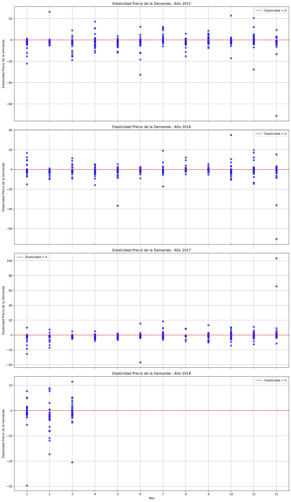

# MAGic-Avocado-TP1

Mini Proyecto para el curso Data Scientist impartido por la [UOC](https://www.uoc.edu/), consistente en el análisis del set de datos [Avocado Prices](https://www.kaggle.com/datasets/neuromusic/avocado-prices/data).

Componentes del equipo: 
 - Alba Godoy Domínguez
 - Gustavo Chávez
 - Montserrat López Ibáñez

## EDA (Exploratory Data Analysis)

Iniciamos el análisis realizando un EDA (Exploratory Data Analysis) en el transcurso del cual descubrimos que:
- El dataset tiene 18.249 filas y 11 columnas.
- Los datos están tomados semanalmente, es decir, hay 4/5 mediciones por cada mes.
- El rango de fechas para la columna 'Date' incluye los años 2015 a 2018.
- El año 2018 está incompleto, de modo que sólo tenemos datos de enero a marzo.
- En las columnas de calibre ('4046', '4225', '4770') hay valores a cero (0.0). En concreto, 242 ceros en la columna '4046', 61 ceros en la columna '4225', 5.497 ceros en la columna '4770'. Todos estos registros corresponden a aguacates de tipo orgánico, excepto una fila (df.iloc[2998]) que es de tipo convencional.
- La columna 'Total Bags' tiene 15 filas a cero (0.0), todas correspondientes a aguacates de tipo orgánico.
- Asimismo, las columnas 'Small Bags', 'Large Bags' y 'XLarge Bags' tienen 159, 2.370 y 12.048 filas a cero (0.0) respectivamente.
- La columna 'region' incluye información heterogénea, es decir, una mezcla de ciudades, regiones, regiones ampliadas (*greater regions*), y también registros para el total de Estados Unidos (*TotalUS*).
- La región WestNewMexico tiene 3 filas menos que el resto de regiones.

## 1. Series Temporales

Puesto que las mediciones son semanales (4/5) mediciones por mes, al calcular las series temporales para 'AveragePrice' debemos configurarlas con `period=52`.

En la gráfica resultante observamos claramente un patrón repetitivo de año en año: bajada de precio en el mes de febrero , así como un pico de subida en los meses de octubre/noviembre. En septiembre se empieza a acabar la temporada de cosecha del aguacate, y por eso es probable que el precio suba en los meses siguientes. Si añadimos el hecho de que en noviembre se celebra el día de Acción de Gracias, en el cual es muy común utilizar aguacate para hacer guacamole en USA, tenemos el terreno abonado para una subida de precios.

Puesto que el dataset contiene información heterogénea (mezcla de ciudades, regiones, etc.) para el análisis de estacionalidad por región utilizaremos únicamente las regiones ampliadas, **GreaterRegions**, que nos permite un análisis visual más interpretable.

En esta gráfica destaca una caída de precio muy notable y uniforme en todas las regiones, en invierno de 2017. Además, destaca en particular la evolución de tres regiones (California, Northeast y SouthCentral), por los siguientes motivos:
- California tiene los picos más pronunciados en el procio promedio tando en subidas como en caídas, es decir, demuestra gran inestabilidad.
- Northeast es la región con el precio promedio más elevado.
- SouthCentral, en contraposición a Northeast, es la región con el precio promedio más bajo.

Los dos últimos puntos pueden observarse más fácilmente si agrupamos los datos anualmente:

Sin embargo, en este gráfico quedan enmascaradas las caídas de precio de California, por ser sucesos mensuales.

Otro modo de ver esas diferencias entre regiones es mediande un boxplot anual por region, donde rápidamente se detectan los _outliers_ correspondientes a picos y valles en la gráfica de líneas.

# (TO DO): gráfica y comentar apartado 01-03

Al evaluar la característica 'Total Volume', filtrando de nuevo por **GreaterRegions**, para ver la tendencia de ventas a lo largo del tiempo, observamos caídas en el volumen de aguacates vendidos just a finales de año, lo cual concuerda con la subida de precio que habíamos observado anteriormente en octubre/noviembre.

## 2. Gráficos para visualización

Al analizar la relación entre las variables 'Total Volume' y 'region', mediante una gráfica de violín, enseguida observamos una anomalía:

Ya habíamos comentado el contenido heterogéneo de la columna region, donde aparecen mezcladas ciudades, regiones, regiones ampliadas e incluso entradas para el total de Estados Unidos. Esta gráfica de violín confirma nuestra observación inicial.

Si descartamos las entradas con valor 'TotalUS' en la variable 'region', entonces obtenemos un nuevo gráfico de violín:

Esto ya es más razonable, aunque nos sigue indicando una gran concentración de datos en los valores bajos de 'Total Volume'. Esto es debido a que existen más filas correspondientes a ciudades, que a regiones o regiones ampliadas. Por esto el violín se estrecha hacia la derecha.

Por tanto, para continuar el estudio (y en proyecto en general), hemos decidido centrarnos en una sola de esas categorías: **GreaterRegions**.

Considerando sólo **GreaterRegions**, al estudiar el histograma de 'Total Volume' para ver la distribución de valores, vemos que están concentrados en dos bloques, uno en el orden de 106 y otro en el orden de ~ 107.

Al realizar histogramas, es importante tener en cuenta el parámetro bins, ya que éste determina el tamaño de los bloque y por tanto la precisión/sensibilidad de nuestra gráfica. En nuestro caso, hemos utilizado `bins=150`.

En lugar de utilizar una escala logarítmica para uniformizar la gráfica, preferimos estudiar ambos bloques en detalle, mediante histogramas separados, estableciendo el umbral de separación en 106 (`valor_umbral = 0.1e7`):

Al cuestionarnos qué podría explicar volúmenes de venta tan dispares, decidimos estudiar la relación de 'Total Volume' con 'type', y llegamos a la conclusión (obvia, por otro lado) de que los volúmenes de venta de aguacates orgánicos (correspondientes al histograma superior) son mucho menores que los volúmenes de aguacates convencionales (correspondientes al histograma inferior). Por tanto, deberemos analizar los datos para ambos tipos de forma separada.

Por otro lado, del estudio por tamaño de bolsa se desprende que las bolsas pequeñas (Small Bags) se venden más que las demás (Large Bags, o bien XLarge Bags), tal y como se muestra en la siguiente gráfica.

## 3. Elasticidad del precio

Para estudiar la elasticidad de precios, partimos de nuevo únicamente de las filas correspondientes a **GreaterRegions**. 

Al aplicar la función `pct_change()` a las variables 'Total Volume' y 'AveragePrice', de las 2703 filas iniciales para GreaterRegions, obtenemos 1448 filas con una variación porcentual inferior al 0.1%. Esto puede indicar períodos con estabilidad en los precios.

Para simplificar la visualización, calculamos la media por año.

Tenemos una elasticidad negativa entre -1,75 y -0.8 aproximadamente. Una elasticidad del precio negativa nos señala que existe una relación inversa entre el precio y la cantidad demandada. Dado que la mayoría de años la elasticidad es menor que -1 (excepto en 2017 que subió un poco por encima de -1) se puede considerar que la demanda es elástica, que significa que los consumidores son sensibles a los cambios de precio y por lo tanto, un aumento significativo del precio podría provocar una disminución significativa de la demanda. Esta conclusión tiene sentido ya que el aguacate no es en USA un alimento de primera necesidad como lo sería la leche o el pan.

## 2. Análisis cohortes

## 2. Correlación y regresión

