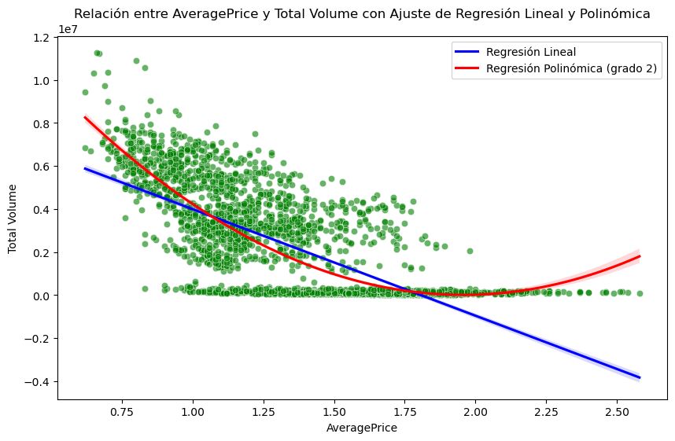
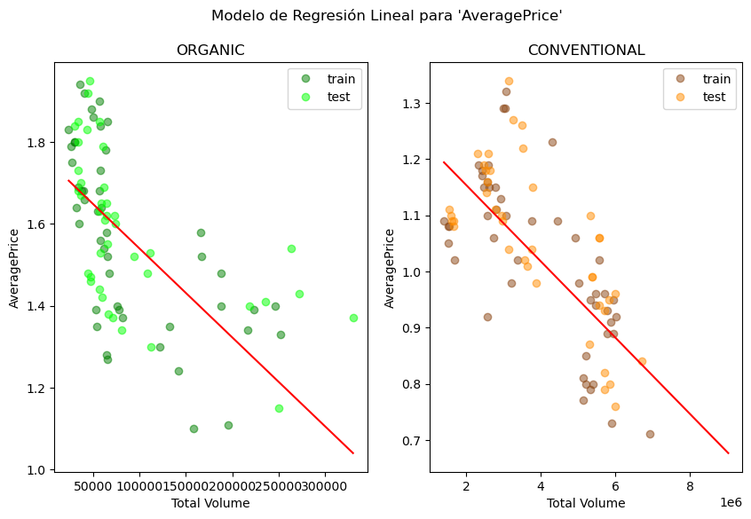

# MAGic-Avocado-TP1

Mini Proyecto para el curso Data Scientist impartido por la [UOC](https://www.uoc.edu/), consistente en el análisis del set de datos [Avocado Prices](https://www.kaggle.com/datasets/neuromusic/avocado-prices/data).

Componentes del equipo: 
 - Alba Godoy Domínguez
 - Gustavo Chavez
 - Montserrat López Ibáñez

## EDA (Exploratory Data Analysis)

Iniciamos el análisis realizando un EDA (Exploratory Data Analysis) en el transcurso del cual descubrimos que:
- El dataset tiene 18.249 filas y 11 columnas.
- Los datos están tomados semanalmente, es decir, hay 4/5 mediciones por cada mes.
- El rango de fechas para la columna 'Date' incluye los años 2015 a 2018.
- El año 2018 está incompleto, de modo que sólo tenemos datos de enero a marzo.
- En las columnas de calibre ('4046', '4225', '4770') hay valores a cero (0.0). En concreto, 242 ceros en la columna '4046', 61 ceros en la columna '4225', 5.497 ceros en la columna '4770'. Todos estos registros corresponden a aguacates de tipo orgánico, excepto una fila (df.iloc[2998]) que es de tipo convencional.
- La columna 'Total Bags' tiene 15 filas a cero (0.0), todas correspondientes a aguacates de tipo orgánico.
- Asimismo, las columnas 'Small Bags', 'Large Bags' y 'XLarge Bags' tienen 159, 2.370 y 12.048 filas a cero (0.0) respectivamente.
- La columna 'region' incluye información heterogénea, es decir, una mezcla de ciudades, regiones, regiones ampliadas (*greater regions*), y también registros para el total de Estados Unidos (*TotalUS*).
- La región WestNewMexico tiene 3 filas menos que el resto de regiones.

## 1. Series Temporales

Puesto que las mediciones son semanales (4/5) mediciones por mes, al calcular las series temporales para 'AveragePrice' debemos configurarlas con `period=52`.

En la gráfica resultante observamos claramente un patrón repetitivo de año en año: bajada de precio en el mes de febrero , así como un pico de subida en los meses de octubre/noviembre. En septiembre se empieza a acabar la temporada de cosecha del aguacate, y por eso es probable que el precio suba en los meses siguientes. Si añadimos el hecho de que en noviembre se celebra el día de Acción de Gracias, en el cual es muy común utilizar aguacate para hacer guacamole en USA, tenemos el terreno abonado para una subida de precios.

Puesto que el dataset contiene información heterogénea (mezcla de ciudades, regiones, etc.) para el análisis de estacionalidad por región utilizaremos únicamente las regiones ampliadas, **GreaterRegions**, que nos permite un análisis visual más interpretable.

En esta gráfica destaca una caída de precio muy notable y uniforme en todas las regiones, en invierno de 2017. Además, destaca en particular la evolución de tres regiones (California, Northeast y SouthCentral), por los siguientes motivos:
- California tiene los picos más pronunciados en el procio promedio tando en subidas como en caídas, es decir, demuestra gran inestabilidad.
- Northeast es la región con el precio promedio más elevado.
- SouthCentral, en contraposición a Northeast, es la región con el precio promedio más bajo.

Los dos últimos puntos pueden observarse más fácilmente si agrupamos los datos anualmente:

Sin embargo, en este gráfico quedan enmascaradas las caídas de precio de California, por ser sucesos mensuales.

Otro modo de ver esas diferencias entre regiones es mediande un boxplot anual por region, donde rápidamente se detectan los _outliers_ correspondientes a picos y valles en la gráfica de líneas.

Finalmente, para quedarnos con una idea global de evolución de precios, hemos graficado el precio anual para todas las regiones en conjunto.

Como nota de atención, tener en cuenta que en las gráficas anteriores no hemos distinguido entre aguacates orgánicos y convencionales. Pero esto lo veremos en detalle más adelante.

## 2. Gráficos para visualización

Al evaluar la característica 'Total Volume', filtrando de nuevo por **GreaterRegions**, para ver la tendencia de ventas a lo largo del tiempo, observamos caídas en el volumen de aguacates vendidos just a finales de año, lo cual concuerda con la subida de precio que habíamos observado anteriormente en octubre/noviembre.

Al analizar la relación entre las variables 'Total Volume' y 'region', mediante una gráfica de violín, enseguida observamos una anomalía:

Ya habíamos comentado el contenido heterogéneo de la columna region, donde aparecen mezcladas ciudades, regiones, regiones ampliadas e incluso entradas para el total de Estados Unidos. Esta gráfica de violín confirma nuestra observación inicial.

Si descartamos las entradas con valor 'TotalUS' en la variable 'region', entonces obtenemos un nuevo gráfico de violín:

Esto ya es más razonable, aunque nos sigue indicando una gran concentración de datos en los valores bajos de 'Total Volume'. Esto es debido a que existen más filas correspondientes a ciudades, que a regiones o regiones ampliadas. Por esto el violín se estrecha hacia la derecha.

Por tanto, para continuar el estudio (y en proyecto en general), hemos decidido centrarnos en una sola de esas categorías: **GreaterRegions**.

Considerando sólo **GreaterRegions**, al estudiar el histograma de 'Total Volume' para ver la distribución de valores, vemos que están concentrados en dos bloques, uno en el orden de 106 y otro en el orden de ~ 107.

Al realizar histogramas, es importante tener en cuenta el parámetro bins, ya que éste determina el tamaño de los bloque y por tanto la precisión/sensibilidad de nuestra gráfica. En nuestro caso, hemos utilizado `bins=150`.

En lugar de utilizar una escala logarítmica para uniformizar la gráfica, preferimos estudiar ambos bloques en detalle, mediante histogramas separados, estableciendo el umbral de separación en 106 (`valor_umbral = 0.1e7`):

Al cuestionarnos qué podría explicar volúmenes de venta tan dispares, decidimos estudiar la relación de 'Total Volume' con 'type', y llegamos a la conclusión (obvia, por otro lado) de que los volúmenes de venta de aguacates orgánicos (correspondientes al histograma superior) son mucho menores que los volúmenes de aguacates convencionales (correspondientes al histograma inferior).

Por tanto, deberemos analizar los datos para ambos tipos de forma separada.

Por otro lado, del estudio por tamaño de bolsa se desprende que las bolsas pequeñas (Small Bags) se venden más que las demás (Large Bags, o bien XLarge Bags), tal y como se muestra en la siguiente gráfica.

Y si separamos por tipo de aguacate:

## 3. Elasticidad del precio

Primeramente, observamos la evolución anual del precio para tener una primera impresión.

Para estudiar la elasticidad de precios, partimos de nuevo únicamente de las filas correspondientes a **GreaterRegions**. 

Al aplicar la función `pct_change()` a las variables 'Total Volume' y 'AveragePrice', de las 2703 filas iniciales para GreaterRegions, obtenemos 1448 filas con una variación porcentual inferior al 0.1%. Esto puede indicar períodos con estabilidad en los precios.

Para simplificar la visualización, calculamos la media por año.

Tenemos una elasticidad negativa entre -1,75 y -0.8 aproximadamente. Una elasticidad del precio negativa nos señala que existe una relación inversa entre el precio y la cantidad demandada. Dado que la mayoría de años la elasticidad es menor que -1 (excepto en 2017 que subió un poco por encima de -1) se puede considerar que la demanda es elástica, que significa que los consumidores son sensibles a los cambios de precio y por lo tanto, un aumento significativo del precio podría provocar una disminución significativa de la demanda. Esta conclusión tiene sentido ya que el aguacate no es en USA un alimento de primera necesidad como lo sería la leche o el pan.

Si ahora estudiamos ambos tipos por separado, vemos que los precios medios de convencional y orgánico son muy distintos.

Si efectuamos el estudio de elasticidad:

Vemos que la elasticidad es distinta para los tipos de aguacate sobretodo a partir de 2017 en que para los organicos la elasticidad se acerca a cero y por el contrario los convencionales se aleja hasta alcanzar más allà de -2. Este cambio en 2017 sugiere una divergencia de comportamiento de consumo entre los dos tipos de aguacates: los consumidores de productos orgánicos parecen cada vez menos sensibles al precio, mientras que los consumidores de convencionales son mucho más sensibles. 

Los consumidores de aguacates orgánicos tienden a ser más inelásticos, mostrando lealtad a este segmento sin importar el precio.

Los consumidores de aguacates convencionales son más sensibles al precio, quizás porque no ven la misma necesidad de consumir aguacates.

## 4. Análisis cohortes

Para el análisis de cohortes agrupamos los datos trimestralmente y vemos la evolución, tanto del precio promedio como del volumen de demanda. Dado que las magnitudes de las variables son muy diferentes (para 'Total Volume' estamos hablando de cantidades alrededor de 1.2e9, mientras que para 'AveragePrice' estamos hablando de cantidades alrededor de 1.5), hemos separado los resultados en dos gráficas distintas.

Observamos que son gráficas opuestas: los picos en la gráfica de 'AveragePrice' se corresponden con valles en la gráfica de 'Total Volume', y viceversa, lo cual tiene sentido.

Ahora analizamos la mismas cohortes trimestrales pero por región.

Aquí se puede apreciar que las regiones con más volumen de ventas son California, SouthCentral y West, para todos los trimestres.

De hecho, si en lugar de tomar sólo **GreaterRegions** como hemos hecho hasta ahora, tomamos todos los registros del DataFrame (a excepción de TotalUS), y filtramos las filas para excluir el 2018 --que está incompleto-- y que así la gráfica no decaiga bruscamente, podemos observar claramente que los volúmenes de California, SouthCentral y West destacan muy por encima del resto.

Al identificar cada una de las tres franjas que se observan en la gráfica:

Obtenemos los siguientes resultados:

Así, como dato notorio, observamos que, aunque Los Ángeles es una ciudad, por volumen de ventas queda incluido en la cohorte de volúmenes medios.

En cuanto al análisis de cohorte en función del tamaño de bolsa, vemos claramente que las de tipo Small Bags son las más vendidas. No obstante, son las más inestables también. Aunque las Large Bags se venden en menor cantidad, su volumen de venta es mucho más estable, lo que podría indicar una preferencia de compra por parte de los clientes.

## 5. Correlación y regresión

Si tomamos todas las variables numéricas del DataFrame, podemos hacer un gráfico de tipo _heatmap_ para la matriz de correlación entre esos datos.

Puesto que sabemos que Total Bags es la combinación de Small Bags, Large Bags i XLarge Bags, podemos simplificar el heatmap y dejar sólo Total Bags.

Podemos ver que el total volume está altamente correlacionado con el total bags y también la variedad 4046 y 4225. Esto es porque seguramente la venta de las variedades de aguacate (4046, 4225) definen mayormente el volumen de ventas.

El hecho de que estas variables esten altamente correlacionadas puede influir en el estudio dado que los modelos de regresión lineal con alta correlación entre sus variables pueden resultar altamente inestables, generar errores numéricos y un rendimiento de predicción muy deficiente. 

Al analizar la dispersión entre las variables clave 'AveragePrice' y 'Total Volume', vemos un acúmulo de puntos cercanos a 0.

Podríamos concluir que la regresión polinómica de grado 2 es más ajustada. Sin embargo, la aproximación no es buena porque el acúmulo de puntos cercanos a 0 nos indica lo que ya habíamos observado: los volúmenes de venta de aguacates orgánicos son notablemente más bajos. Por tanto, es conveniente es estudio de orgánicos y convencionales por separado.

Ahora las aproximaciones, tanto lineal como polinómicas, son mejores, siempre en un rango de valores entre 1 y 2.25$ para aguacate orgánico, y entre 0.7 y 1.6$ para aguacate convencional.

Comentar que durante el cálculo del modelo de regersión lineal, por curiosidad, comprobamos manualmente el resultado de la función `.predict()`:

Si ahora realizamos predicciones mensuales de 'AveragePrice' usando datos trimestrales, mediante una regresión lineal, utilizando los 2 primeros meses para precedir el tercero, obtenemos la siguiente gráfica (donde los puntos azules corresponden a los 2 primeros meses, y los naranja al tercer mes).

Tal y como ya se observa en la gráfica, el modelo no es demasiado bueno. De hecho, al evaluarlo obtenemos los siguientes valores para R^2 y MSE:

Si hacemos predicciones trimestrales pero usando todas las variables numéricas, el modelo de predicción para 'AveragePrice' parece ser mejor:

Y si realizamos un modelo de **regresión múltiple** usando las variables numéricas 'Total Volume', '4046', '4225', '4770', y 'Total Bags' para predecir 'AveragePrice':

Se muestran a continuación los coeficientes obtenidos para el modelo lineal y polinómico:

Y aquí, juntamente con sus nombres:

Para predecir AveragePrice en el modelo lineal vemos que el peso menos significativo es la de la columna '4770'. El resto están más o menos igualadas. Todas de manera directa excepto el Total Volume que es inversamente proporcional.

En el modelo polinómico, muchos de los coeficientes son negativos, lo que indica que esas combinaciones de variables tienen un efecto negativo sobre el AveragePrice.
Por ejemplo, el coeficiente de Total Volume - 4046 es -8.579018e-08, lo que significa que un aumento en la interacción entre el volumen total y el código 4046 reduce el valor de AveragePrice.

También en el modelo polinómico, algunos coeficientes son positivos, lo que indica que el aumento en esas variables o combinaciones tiene un efecto positivo en AveragePrice.
Por ejemplo, el coeficiente de Total Volume^2 es 4.110745e-08, lo que indica que el aumento cuadrático en el Total Volume aumenta el valor de AveragePrice, aunque el efecto es muy pequeño.

Si analizamos la influencia de las ventas totales en el precio promedio, al aplicar los modelos lineal y polinómico obtenemos lo siguiente:

